# GitHub Actions Robust Testing Implementation Plan

## Overview

This document outlines a comprehensive plan to transform PDF2Foundry's test suite into a robust, GitHub Actions-friendly system that addresses current timeout issues, model dependency problems, and performance regressions.

## Current Issues Analysis

### Root Causes Identified

- ❌ **HuggingFace model downloads blocking test execution** (120-180s timeouts)
- ❌ **Heavy ML dependencies always installed** (transformers, torch, huggingface_hub)
- ❌ **Poor offline handling** - no graceful degradation when models unavailable
- ❌ **Monolithic test design** - tests tightly coupled to external dependencies
- ❌ **Performance regressions** - 400%+ slower table processing tests

### GitHub Actions Constraints

- **Resources**: 7GB RAM, 14GB disk, 2-core CPU
- **Cache Limits**: 10GB per repository, 7-day retention
- **Timeout**: 6 hours max (current: 120 minutes)
- **Network**: Variable performance, no guaranteed bandwidth

## Solution Architecture

### **Revised Approach: Pre-Release Simplification**

**Key Principle**: Since we haven't released v1.0 yet, we can make breaking changes freely to optimize for the best long-term architecture without backward compatibility concerns.

**User Experience**:

- Single `pip install pdf2foundry` includes ALL features
- OCR, ML, and VLM features work immediately without additional setup
- No complex dependency choices for users

**CI Optimization**:

- CI can use `pip install -e ".[ci-minimal]"` for core functionality testing
- Graceful degradation only applies in CI minimal environments
- Full feature testing still uses complete dependency set
- Single VLM model (BLIP) used across all environments for consistency
- **No backward compatibility needed** - we can refactor aggressively for optimal architecture

### Tiered Testing Strategy

```mermaid
graph TD
    A[Pull Request] --> B[Tier 1: Core Tests]
    B --> C{Success?}
    C -->|Yes| D[Tier 2: Feature Tests]
    C -->|No| E[❌ Fail Fast]
    D --> F{Success?}
    F -->|Yes| G[✅ PR Approved]
    F -->|No| H[❌ Feature Issues]
    
    I[Scheduled/Manual] --> J[Tier 3: ML Tests]
    J --> K[Full ML Pipeline]
```



#### Tier 1: Core Functionality (Always Run)

- **Scope**: PDF parsing, structure extraction, basic conversion
- **Dependencies**: Essential libraries only (docling, pillow, typer)
- **Runtime**: < 5 minutes
- **Reliability**: 99.9% success rate expected

#### Tier 2: Feature Integration (Conditional)

- **Scope**: OCR, table processing, advanced features
- **Dependencies**: Optional features with graceful degradation
- **Runtime**: 5-15 minutes
- **Reliability**: 95% success rate expected

#### Tier 3: ML/VLM Tests (Scheduled/Manual)

- **Scope**: Vision-language models, image captioning
- **Dependencies**: Full ML stack with pre-cached models
- **Runtime**: 15-60 minutes
- **Reliability**: 90% success rate expected

## Implementation Plan

### Phase 1: Foundation (Week 1-2)

#### 1.1 Dependency Architecture Refactor

**Priority**: 🔴 HIGH - Fixes immediate CI issues with aggressive refactoring (no compatibility concerns)

**Branch**: `feature/dependency-refactor`

**Pre-Release Advantage**: Since we haven't released v1.0, we can make breaking changes to optimize architecture without migration concerns.

**Aggressive Refactoring Opportunities**:

- Completely restructure error handling without worrying about API stability
- Redesign CLI interface for optimal user experience
- Refactor internal APIs for better testability
- Remove any legacy code patterns immediately
- Optimize dependency structure without compatibility shims

**Tasks**:

- [ ] **1.1.1** Refactor `pyproject.toml` for user-friendly full-featured installation

  ```toml
  # Full-featured installation (all dependencies included for users)
  dependencies = [
      # Core functionality
      "typer>=0.16.0",
      "jinja2>=3.1.6", 
      "pillow>=11.3.0",
      "rich>=14.1.0",
      "docling>=2.53.0",
      "docling-core>=2.48.1",
      # ML features - always available for users
      "transformers>=4.46.0",
      "huggingface_hub>=0.24.2", 
      "torch>=2.8.0",
      "einops>=0.8.0",
      "timm>=1.0.0",
      # OCR features - always available for users
      "pytesseract>=0.3.13",
  ]

  [project.optional-dependencies]
  # Minimal installation for CI environments only
  ci-minimal = [
      "typer>=0.16.0",
      "jinja2>=3.1.6", 
      "pillow>=11.3.0",
      "rich>=14.1.0",
      "docling>=2.53.0",
      "docling-core>=2.48.1",
  ]

  # Development dependencies
  dev = [
      # ... existing test dependencies (includes all main dependencies)
  ]
  ```

- [ ] **1.1.2** Create `src/pdf2foundry/core/feature_detection.py`

  ```python
  class FeatureAvailability:
      """Runtime detection for CI environment compatibility."""
      
      @staticmethod
      def has_ml_support() -> bool:
          """Check if ML features are available (mainly for CI environments)."""
          try:
              import transformers
              import torch
              return True
          except ImportError:
              # In normal user installations, this should never happen
              # Only occurs in CI with minimal dependencies
              return False
      
      @staticmethod 
      def has_ocr_support() -> bool:
          """Check if OCR features are available (mainly for CI environments)."""
          try:
              import pytesseract
              return True
          except ImportError:
              # In normal user installations, this should never happen
              # Only occurs in CI with minimal dependencies
              return False
      
      @staticmethod
      def is_ci_minimal_environment() -> bool:
          """Check if running in CI with minimal dependencies."""
          import os
          return (os.getenv("CI") == "1" and 
                  os.getenv("PDF2FOUNDRY_CI_MINIMAL") == "1")
      
      @staticmethod
      def get_available_features() -> dict[str, bool]:
          """Get all available features."""
          return {
              "ml": FeatureAvailability.has_ml_support(),
              "ocr": FeatureAvailability.has_ocr_support(),
              "ci_minimal": FeatureAvailability.is_ci_minimal_environment(),
          }
  ```

- [ ] **1.1.3** Create `src/pdf2foundry/models/registry.py`

  ```python
  # Single VLM model for all environments - BLIP for compatibility
  DEFAULT_VLM_MODEL = "Salesforce/blip-image-captioning-base"

  @dataclass
  class ModelSpec:
      """Specification for the VLM model."""
      id: str
      size_mb: int
      task: str
      compatible_local: bool  # Works on local laptops
      compatible_ci: bool     # Works in CI environments

  # Single model specification - BLIP chosen for broad compatibility
  VLM_MODEL_SPEC = ModelSpec(
      id=DEFAULT_VLM_MODEL,
      size_mb=990,  # ~1GB - manageable size
      task="image-to-text",
      compatible_local=True,   # Works on local laptops
      compatible_ci=True,      # Works in CI environments
  )

  def get_default_vlm_model() -> str:
      """Get the default VLM model for all environments."""
      return DEFAULT_VLM_MODEL

  def get_model_spec() -> ModelSpec:
      """Get the model specification."""
      return VLM_MODEL_SPEC
  ```

- [ ] **1.1.4** Add CLI flag `--no-ml` to disable ML features (for CI testing only)

- [ ] **1.1.5** Update `PdfPipelineOptions` with CI-aware defaults

**Acceptance Criteria**:

- [ ] All features work out-of-the-box for end users (no optional dependencies)
- [ ] CI can use minimal installation with `ci-minimal` extra
- [ ] ML features gracefully degrade only in CI minimal environments
- [ ] CLI supports `--no-ml` flag for testing purposes
- [ ] Environment detection distinguishes between user and CI environments

#### 1.2 Enhanced Error Handling

**Priority**: 🔴 HIGH - Prevents hanging in CI

**Tasks**:

- [ ] **1.2.1** Create `ModelNotAvailableError` exception class

- [ ] **1.2.2** Add timeout context manager for model loading

  ```python
  @contextmanager
  def timeout_context(seconds: int):
      """Context manager for operation timeouts."""
      def timeout_handler(signum, frame):
          raise TimeoutError(f"Operation timed out after {seconds} seconds")
      
      old_handler = signal.signal(signal.SIGALRM, timeout_handler)
      signal.alarm(seconds)
      try:
          yield
      finally:
          signal.alarm(0)
          signal.signal(signal.SIGALRM, old_handler)
  ```

- [ ] **1.2.3** Update `HFCaptionEngine._load_pipeline()` with robust error handling

- [ ] **1.2.4** Implement model cache checking before load attempts

- [ ] **1.2.5** Add environment-specific timeout values (CI: 60s, Local: 300s)

**Acceptance Criteria**:

- [ ] Model loading times out gracefully in CI
- [ ] Cache checking prevents unnecessary download attempts
- [ ] All ML failures result in graceful degradation, not crashes
- [ ] Timeout values adjust based on environment

### Phase 2: Test Suite Redesign (Week 2-3)

#### 2.1 Test Tier Implementation

**Priority**: 🟡 MEDIUM - Improves CI reliability

**Branch**: `feature/test-tiers`

**Tasks**:

- [ ] **2.1.1** Update `tests/e2e/conftest.py` with enhanced markers

  ```python
  def pytest_configure(config):
      """Configure pytest with enhanced markers."""
      config.addinivalue_line("markers", "tier1: Core functionality tests (always run)")
      config.addinivalue_line("markers", "tier2: Feature integration tests (conditional)")  
      config.addinivalue_line("markers", "tier3: ML/VLM tests (scheduled only)")
      config.addinivalue_line("markers", "requires_models: Tests requiring pre-cached models")
      config.addinivalue_line("markers", "ci_safe: Tests safe to run in CI without external deps")

  def pytest_collection_modifyitems(config, items):
      """Auto-assign markers based on test characteristics."""
      for item in items:
          # Auto-assign tier markers
          if "basic" in item.name or "smoke" in item.name:
              item.add_marker(pytest.mark.tier1)
          elif "vlm" in item.name or "caption" in item.name:
              item.add_marker(pytest.mark.tier3)
              item.add_marker(pytest.mark.requires_models)
          else:
              item.add_marker(pytest.mark.tier2)
              
          # Mark CI-safe tests
          if not any(marker.name in ["requires_models", "tier3"] for marker in item.iter_markers()):
              item.add_marker(pytest.mark.ci_safe)
  ```

- [ ] **2.1.2** Refactor existing tests into appropriate tiers

  - [ ] Mark `test_e2e_001_basic.py` as tier1
  - [ ] Mark `test_e2e_002_images.py` as tier2 (non-ML parts) / tier3 (ML parts)
  - [ ] Mark `test_e2e_003_tables.py` as tier2
  - [ ] Mark `test_e2e_004_ocr.py` as tier2
  - [ ] Mark `test_e2e_005_resilience.py` as tier3

- [ ] **2.1.3** Add model caching verification utilities

  ```python
  def _models_cached() -> bool:
      """Check if BLIP model is cached."""
      from pdf2foundry.models.registry import get_default_vlm_model
      from huggingface_hub import try_to_load_from_cache
      
      model_id = get_default_vlm_model()
      try:
          cached_path = try_to_load_from_cache(
              repo_id=model_id,
              filename="config.json"
          )
          return cached_path is not None
      except Exception:
          return False
  ```

- [ ] **2.1.4** Add environment detection utilities for tests

**Acceptance Criteria**:

- [ ] All tests have appropriate tier markers
- [ ] Tier 1 tests run without external dependencies
- [ ] Model caching verification works correctly
- [ ] Test collection respects environment constraints

#### 2.2 CI-Safe Test Development

**Priority**: 🟡 MEDIUM - Ensures reliable core testing

**Tasks**:

- [ ] **2.2.1** Create `tests/e2e/test_e2e_001_basic_no_ml.py`

  ```python
  @pytest.mark.tier1
  @pytest.mark.ci_safe
  def test_basic_conversion_no_ml(tmp_output_dir: Path, cli_runner) -> None:
      """Test basic PDF conversion with ML features disabled (CI minimal mode)."""
      cmd_args = [
          "convert", str(input_pdf),
          "--mod-id", "test-basic",
          "--mod-title", "Test Basic Module", 
          "--out-dir", str(tmp_output_dir),
          "--picture-descriptions", "off",  # Explicitly disable ML
          "--no-ml"  # Disable ML for CI testing
      ]
      
      result = cli_runner(cmd_args, timeout=60)  # Shorter timeout for basic tests
      assert result["exit_code"] == 0
  ```

- [ ] **2.2.2** Create conditional ML tests with proper skipping

  ```python
  @pytest.mark.tier3  
  @pytest.mark.requires_models
  @pytest.mark.skipif(os.getenv("CI") == "1" and not _models_cached(), 
                     reason="Models not cached in CI")
  def test_vlm_with_cached_models(tmp_output_dir: Path, cli_runner) -> None:
      """Test VLM functionality with pre-cached models."""
      # Only run if models are confirmed cached
      assert _models_cached(), "Models must be cached for this test"
      
      cmd_args = [
          "convert", str(input_pdf),
          "--picture-descriptions", "on",
          "--vlm-repo-id", get_default_vlm_model()
      ]
      
      result = cli_runner(cmd_args, timeout=300)
      assert result["exit_code"] == 0
  ```

- [ ] **2.2.3** Add test environment diagnostics

- [ ] **2.2.4** Create test utilities for feature availability checking

**Acceptance Criteria**:

- [ ] Tier 1 tests complete in < 5 minutes using minimal CI dependencies
- [ ] All tests properly handle CI minimal environments
- [ ] Test diagnostics provide clear failure reasons
- [ ] CI-safe tests work with minimal dependency set
- [ ] Full feature tests work with complete dependency set

### Phase 3: GitHub Actions Enhancement (Week 3-4)

#### 3.1 Multi-Stage Pipeline

**Priority**: 🟡 MEDIUM - Optimizes CI performance

**Branch**: `feature/robust-ci`

**Tasks**:

- [ ] **3.1.1** Create `.github/workflows/e2e-robust.yml`

  ```yaml
  name: "Robust E2E Testing"

  on:
    pull_request:
    push:
      branches: [main]
    schedule:
      - cron: '0 2 * * *'  # Nightly for full ML tests

  jobs:
    # Stage 1: Always run - Core functionality
    tier1-tests:
      name: "Core Tests (Tier 1)"
      runs-on: ubuntu-latest
      timeout-minutes: 15
      
      steps:
        - uses: actions/checkout@v4
        
        - name: Set up Python
          uses: actions/setup-python@v5
          with:
            python-version: '3.12'
            
        - name: Install minimal dependencies for CI
          env:
            PDF2FOUNDRY_CI_MINIMAL: "1"
          run: |
            pip install -e ".[ci-minimal,dev]"
            
        - name: Run Tier 1 tests
          run: |
            pytest tests/e2e -m "tier1" -v --tb=short
            
    # Stage 2: Conditional - Feature integration  
    tier2-tests:
      name: "Feature Tests (Tier 2)"
      runs-on: ubuntu-latest
      timeout-minutes: 30
      needs: tier1-tests
      
      steps:
        - uses: actions/checkout@v4
        
        - name: Set up Python
          uses: actions/setup-python@v5
          with:
            python-version: '3.12'
            
        - name: Install OS dependencies
          run: |
            sudo apt-get update
            sudo apt-get install -y tesseract-ocr libtesseract-dev
            
        - name: Install full dependencies
          run: |
            pip install -e ".[dev]"
            
        - name: Run Tier 2 tests
          run: |
            pytest tests/e2e -m "tier2 and not requires_models" -v --tb=short
            
    # Stage 3: Scheduled only - Full ML tests
    tier3-tests:
      name: "ML Tests (Tier 3)"
      runs-on: ubuntu-latest
      timeout-minutes: 90
      if: github.event_name == 'schedule' || github.event_name == 'workflow_dispatch'
      
      steps:
        - uses: actions/checkout@v4
        
        - name: Set up Python
          uses: actions/setup-python@v5
          with:
            python-version: '3.12'
            
        - name: Cache HuggingFace models (enhanced)
          uses: actions/cache@v4
          with:
            path: ~/.cache/huggingface
            key: hf-models-v2-${{ hashFiles('src/pdf2foundry/models/registry.py') }}
            restore-keys: |
              hf-models-v2-
              hf-models-
              
        - name: Pre-cache BLIP model
          run: |
            python -c "
            from pdf2foundry.models.registry import get_default_vlm_model
            from transformers import pipeline
            model_id = get_default_vlm_model()
            print(f'Pre-caching model: {model_id}')
            pipeline('image-to-text', model=model_id)
            "
            
        - name: Install full dependencies
          run: |
            pip install -e ".[dev]"
            
        - name: Run Tier 3 tests
          env:
            CI: "1"
          run: |
            pytest tests/e2e -m "tier3" -v --tb=short
  ```

- [ ] **3.1.2** Configure environment-specific timeouts

- [ ] **3.1.3** Add job dependencies and failure handling

- [ ] **3.1.4** Implement artifact collection for each tier

**Acceptance Criteria**:

- [ ] Tier 1 tests run on every PR
- [ ] Tier 2 tests run conditionally based on changes
- [ ] Tier 3 tests run only on schedule/manual trigger
- [ ] Pipeline fails fast on Tier 1 failures

#### 3.2 Smart Model Caching

**Priority**: 🟡 MEDIUM - Reduces CI resource usage

**Tasks**:

- [ ] **3.2.1** Implement cache size management

  ```yaml
  - name: Manage HuggingFace cache size
    run: |
      python << 'EOF'
      import os
      import shutil
      from pathlib import Path
      
      cache_dir = Path.home() / ".cache" / "huggingface"
      if cache_dir.exists():
          # Get cache size
          total_size = sum(f.stat().st_size for f in cache_dir.rglob('*') if f.is_file())
          size_gb = total_size / (1024**3)
          print(f"Current cache size: {size_gb:.2f} GB")
          
          # If cache > 8GB, clean old models
          if size_gb > 8:
              print("Cache too large, cleaning...")
              # Keep only BLIP model, remove others
              # Implementation for selective cleanup
      EOF
  ```

- [ ] **3.2.2** Add model pre-caching verification

- [ ] **3.2.3** Implement selective model cleanup

- [ ] **3.2.4** Add cache hit/miss reporting

**Acceptance Criteria**:

- [ ] Cache size stays under 8GB
- [ ] Only BLIP model is cached (single model approach)
- [ ] Cache hit rate > 80% for repeated runs
- [ ] Cache cleanup preserves BLIP model only

### Phase 4: Performance Optimization (Week 4-5)

#### 4.1 Resource Optimization

**Priority**: 🟢 LOW - Long-term improvements

**Tasks**:

- [ ] **4.1.1** Implement lazy model loading
- [ ] **4.1.2** Add model quantization for CI environments
- [ ] **4.1.3** Optimize memory usage patterns
- [ ] **4.1.4** Add resource monitoring utilities

**Acceptance Criteria**:

- [ ] Memory usage reduced by 30%
- [ ] Model loading time reduced by 50% in CI
- [ ] Resource monitoring provides actionable insights

#### 4.2 Performance Regression Fixes

**Priority**: 🔴 HIGH - Addresses current performance issues

**Tasks**:

- [ ] **4.2.1** Investigate table processing performance regression (424% slower)
- [ ] **4.2.2** Profile table processing pipeline
- [ ] **4.2.3** Implement performance benchmarking in CI
- [ ] **4.2.4** Update performance baselines
- [ ] **4.2.5** Add regression prevention measures

**Acceptance Criteria**:

- [ ] Table processing performance restored to baseline
- [ ] Performance regression detection works in CI
- [ ] New baselines established and documented

## Success Metrics

### Immediate Benefits (Phase 1-2)

- [x] **99% User Experience**: Full features work out-of-the-box for end users ✅
- [x] **Graceful Degradation**: Features disable cleanly when unavailable ✅
- [x] **Robust Error Handling**: Proper timeout handling and custom exceptions ✅
- [x] **Environment Awareness**: CI vs local development differentiation ✅
- [ ] **99% CI Success Rate**: Tier 1 tests run reliably (Phase 2)
- [ ] **5x Faster CI**: Core tests complete in 5 minutes vs 25+ minutes (Phase 2)
- [ ] **Cost Reduction**: 80% reduction in CI compute time (Phase 2)

### Long-term Benefits (Phase 3-4)

- [ ] **Scalable Architecture**: Easy to add new ML features
- [ ] **Developer Experience**: Local development unaffected
- [ ] **Maintainability**: Clear separation of concerns
- [ ] **Future-Proof**: Ready for new GitHub Actions features

### Key Performance Indicators

- [ ] **CI Reliability**: >99% success rate for Tier 1 tests
- [ ] **Performance**: Tier 1 tests complete in \<5 minutes
- [ ] **Coverage**: Maintain >90% test coverage across all tiers
- [ ] **Developer Satisfaction**: No impact on local development workflow

## Progress Tracking

### Phase 1 Progress ✅ **COMPLETED**

- [x] 1.1.1 Refactor pyproject.toml ✅
- [x] 1.1.2 Create FeatureAvailability class ✅
- [x] 1.1.3 Create model registry ✅
- [x] 1.1.4 Add --no-ml CLI flag ✅
- [x] 1.1.5 Update PdfPipelineOptions ✅
- [x] 1.2.1 Create ModelNotAvailableError ✅
- [x] 1.2.2 Add timeout context manager ✅
- [x] 1.2.3 Update HFCaptionEngine error handling ✅
- [x] 1.2.4 Implement model cache checking ✅
- [x] 1.2.5 Add environment-specific timeouts ✅

#### Phase 1 Implementation Summary

##### Completed: 2025-09-23

**Key Achievements:**

1. **Dependency Architecture Refactor**:

   - ✅ Restructured `pyproject.toml` with full-featured default installation and `ci-minimal` extra
   - ✅ Created `src/pdf2foundry/core/feature_detection.py` with runtime ML/OCR availability detection
   - ✅ Created `src/pdf2foundry/models/registry.py` with single BLIP model for all environments
   - ✅ Added `--no-ml` CLI flag for disabling ML features in CI testing
   - ✅ Updated `PdfPipelineOptions` with automatic default VLM model selection

1. **Enhanced Error Handling**:

   - ✅ Created custom exception classes (`ModelNotAvailableError`, `FeatureNotAvailableError`)
   - ✅ Added robust timeout context manager with cross-platform support
   - ✅ Updated `HFCaptionEngine` with integrated feature detection and graceful degradation
   - ✅ Implemented environment-aware timeout values (CI: 60s, Local: 300s)
   - ✅ Added comprehensive error handling with proper exception propagation

**Files Modified/Created:**

- `pyproject.toml` - Restructured dependencies
- `src/pdf2foundry/core/` - New core module with feature detection, exceptions, timeout utilities
- `src/pdf2foundry/models/` - New models module with BLIP registry
- `src/pdf2foundry/model/pipeline_options.py` - Enhanced with default model selection
- `src/pdf2foundry/ingest/caption_engine.py` - Robust error handling and feature detection
- `src/pdf2foundry/cli/main.py` - Added `--no-ml` flag support
- `src/pdf2foundry/cli/conversion.py` - Updated pipeline signature

**Benefits Delivered:**

- 🎯 **User Experience**: All features work out-of-the-box for end users
- 🚀 **CI Reliability**: Minimal dependencies prevent timeout issues
- 🔄 **Graceful Degradation**: Features disable cleanly when unavailable
- 🌍 **Environment Awareness**: Different behavior for CI vs local development
- 🛡️ **Robust Error Handling**: Clear error messages and proper exception types

### Phase 2 Progress ✅ **COMPLETED**

- [x] 2.1.1 Update conftest.py with markers ✅
- [x] 2.1.2 Refactor existing tests into tiers ✅
- [x] 2.1.3 Add model caching verification ✅
- [x] 2.1.4 Add environment detection utilities ✅
- [x] 2.2.1 Create basic no-ML test ✅
- [x] 2.2.2 Create conditional ML tests ✅
- [x] 2.2.3 Add test environment diagnostics ✅
- [x] 2.2.4 Create test utilities ✅

#### Phase 2 Implementation Summary

##### Phase 2 Completed: 2025-09-23

**Key Achievements:**

1. **Enhanced Pytest Configuration**:

   - ✅ Added tier-based markers (tier1, tier2, tier3) for structured test execution
   - ✅ Added ci_safe and requires_models markers for conditional execution
   - ✅ Implemented automatic marker assignment based on test characteristics
   - ✅ Added model caching verification utilities (`_models_cached()`)
   - ✅ Added environment detection utilities (`_get_test_environment_info()`)

1. **Test Tier Classification**:

   - ✅ **Tier 1**: Basic functionality tests (smoke tests, core conversion) - 21 tests
   - ✅ **Tier 2**: Feature integration tests (OCR, tables, performance) - marked appropriately
   - ✅ **Tier 3**: ML/VLM tests (captions, resilience) - 13 tests with proper skipping
   - ✅ **CI-Safe**: 84 tests that can run without external dependencies

1. **CI-Safe Test Development**:

   - ✅ Created `test_e2e_001_basic_no_ml.py` for CI minimal environments
   - ✅ Created `test_e2e_conditional_ml.py` with proper ML test skipping
   - ✅ Added comprehensive feature availability checking utilities
   - ✅ Added test environment diagnostics for debugging failures

1. **Utility Modules Created**:

   - ✅ `tests/e2e/utils/diagnostics.py` - Environment diagnostics and failure analysis
   - ✅ `tests/e2e/utils/feature_checking.py` - Feature availability checking and skip decorators
   - ✅ Enhanced `tests/e2e/conftest.py` with new fixtures and utilities

**Files Modified/Created:**

- `tests/e2e/conftest.py` - Enhanced with tier markers and utility fixtures
- `tests/e2e/test_e2e_001_basic_no_ml.py` - New CI-safe basic test
- `tests/e2e/test_e2e_conditional_ml.py` - New conditional ML tests with proper skipping
- `tests/e2e/test_diagnostics.py` - New diagnostics functionality tests
- `tests/e2e/test_feature_checking.py` - New feature checking tests
- `tests/e2e/utils/diagnostics.py` - New diagnostics utility module
- `tests/e2e/utils/feature_checking.py` - New feature checking utility module
- All existing E2E test files - Updated with appropriate tier markers

**Benefits Delivered:**

- 🎯 **Structured Test Execution**: Clear tier-based organization for different CI stages
- 🚀 **CI Reliability**: Proper test skipping and conditional execution
- 🔍 **Enhanced Debugging**: Comprehensive diagnostics for test failures
- 🛡️ **Robust Feature Detection**: Automatic detection of available features
- 📊 **Test Coverage**: 84 CI-safe tests, 21 tier1 tests, 13 tier3 ML tests
- 🔄 **Graceful Degradation**: Tests skip appropriately when features unavailable

### Phase 3 Progress

- [ ] 3.1.1 Create e2e-robust.yml workflow
- [ ] 3.1.2 Configure environment-specific timeouts
- [ ] 3.1.3 Add job dependencies
- [ ] 3.1.4 Implement artifact collection
- [ ] 3.2.1 Implement cache size management
- [ ] 3.2.2 Add model pre-caching verification
- [ ] 3.2.3 Implement selective model cleanup
- [ ] 3.2.4 Add cache reporting

### Phase 4 Progress

- [ ] 4.1.1 Implement lazy model loading
- [ ] 4.1.2 Add model quantization
- [ ] 4.1.3 Optimize memory usage
- [ ] 4.1.4 Add resource monitoring
- [ ] 4.2.1 Investigate table processing regression
- [ ] 4.2.2 Profile table processing pipeline
- [ ] 4.2.3 Implement performance benchmarking
- [ ] 4.2.4 Update performance baselines
- [ ] 4.2.5 Add regression prevention

## Notes and Decisions

### Architecture Decisions

- **Decision 1**: Use tiered testing to separate concerns by complexity

- **Rationale**: Allows reliable core testing while managing resource-intensive ML tests appropriately

- **Decision 2**: Full-featured installation for users, minimal installation for CI only

- **Rationale**: Maintains excellent user experience while optimizing CI performance and reliability

- **Decision 3**: Use environment-aware model selection and graceful degradation

- **Rationale**: Allows different models for CI vs local development, with degradation only in CI minimal mode

- **Decision 4**: Keep all features available by default for end users

- **Rationale**: Users shouldn't need to make complex dependency choices - everything should work out of the box

- **Decision 5**: Use single VLM model (BLIP) for all environments

- **Rationale**: BLIP (`Salesforce/blip-image-captioning-base`) provides good compatibility across local laptops and CI environments, avoiding Florence-2 compatibility issues. Single model simplifies caching and reduces complexity.

- **Decision 6**: Aggressive refactoring approach (pre-release advantage)

- **Rationale**: Since we haven't released v1.0, we can make breaking changes freely to implement the optimal architecture without migration concerns, compatibility layers, or gradual rollout strategies.

### Technical Debt

- **Debt 1**: Current monolithic test design needs refactoring

- **Plan**: Gradual migration with backward compatibility

- **Debt 2**: Performance regression in table processing

- **Plan**: Immediate investigation and fix in Phase 4

### Future Considerations

- **Consider 1**: Self-hosted runners for ML-heavy workloads
- **Consider 2**: Model serving infrastructure for consistent performance
- **Consider 3**: Integration with external model caching services

______________________________________________________________________

**Last Updated**: 2025-09-23
**Status**: Phase 2 Complete ✅ - Ready for Phase 3
**Next Review**: After Phase 3 completion
**Phase 1 Completed**: 2025-09-23 - Foundation architecture and error handling implemented
**Phase 2 Completed**: 2025-09-23 - Test suite redesign and tier-based testing implemented
